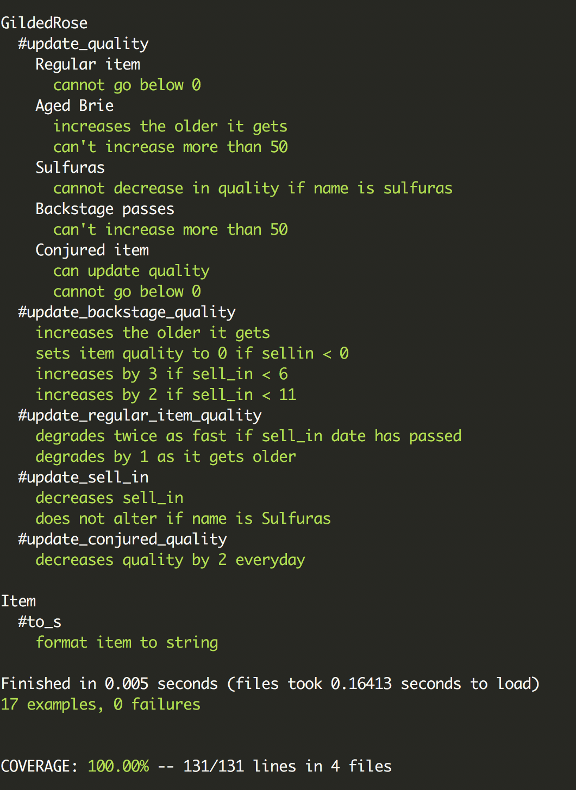

# Gilded Rose Refactoring Kata

[Motivation](#motivation) | [Build status](#build-status) | [Technologies](#technologies) | [Requirements](#requirements) | [Running the App](#running-the-app) | [Running tests](#running-tests) | [Approach](#approach) | [Contributing](#contributing)

---
This project's purpose was to refactor ["GildedRose Kata"](https://github.com/emilybache/GildedRose-Refactoring-Kata).
##  <a name="motivation">**Motivation**</a>
This project was created for a technical test challenge at Makers Academy.

##  <a name="build-status">**Build Status**</a>

##  <a name="technologies">**Technologies**</a>

- Ruby
- RSpec
- Rubocop
- Simplecov

##  <a name="requirements">**Requirements**</a>

 The requirements could be found [here](https://github.com/m-rcd/GildedRose/blob/master/GildedRoseRequirements.txt).

##  <a name="running-the-app">**Running the app**</a>

- Clone this repository:
   `git clone https://github.com/m-rcd/GildedRose/`

- Go into the repository: `cd GildedRose`

- Run `bundle install`

- run `ruby texttest_fixture.rb`

##  <a name="running-tests">**Running tests**</a>

Run `rspec` in your terminal

##  <a name="approach">**Approach**</a>

- I started by adding tests to make sure that I don't break the code.

- I moved item class to its own file

- I then started refactoring by using guard statements when possible, separating updating quality and updating sell in, creating private methods

- I also implemented the new feature requested by the new supplier: conjured items degrades twice as fast as normal items

##  <a name="contributing">**Contributing**</a>

Pull Requests are always welcome.

When you edit the code, please run bundle exec rspec to check all the tests pass.
Also run the linter rubocop  before you git commit.

Ensure the PR description clearly describes the problem and solution. It should include the relevant issue number, if applicable.
